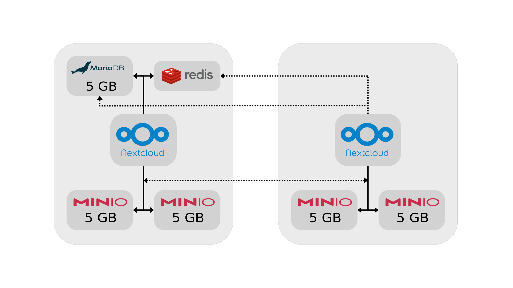

# Architecture

The main objective of the architecture was scalability, storage distribution and high availability. Every node has his own nextcloud worker and part of the storage. These node can be scaled horizontally infinite, because the nextcloud worker is stateless and minIO has no limit on the number of servers it can manage.

One node on top of that contains the databases. This is the only factor that limits the scalability of the system, as every other node needs to access the data of these databases. This Architecture can be scaled horizontally as long the database can keep up.

There are two factors that can result in the system to stop working. If the node with the databases is down then the complete system is down. The other is the minIO object storage, it has replication of data build in. There is no data loss and it will continue to operate as long half of the nodes are online.

As every node can handle requests on port 80 it is possible to use an loadbalancer with health check redirecting requests to any server in the cluster.
